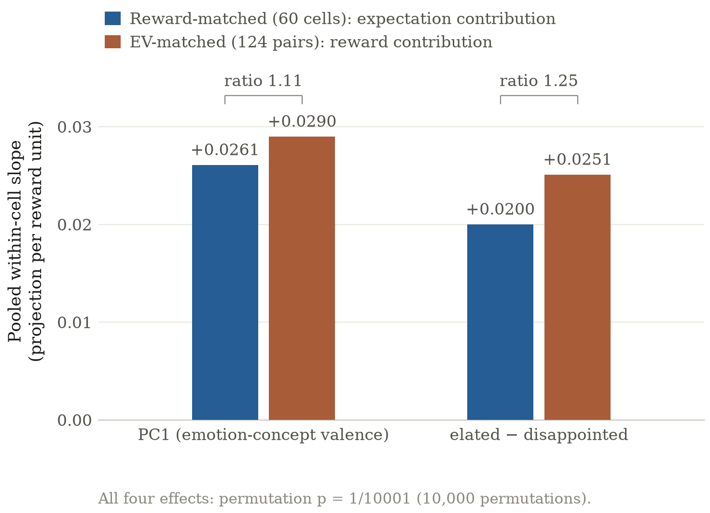
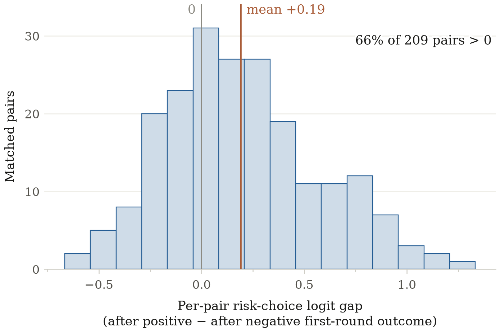
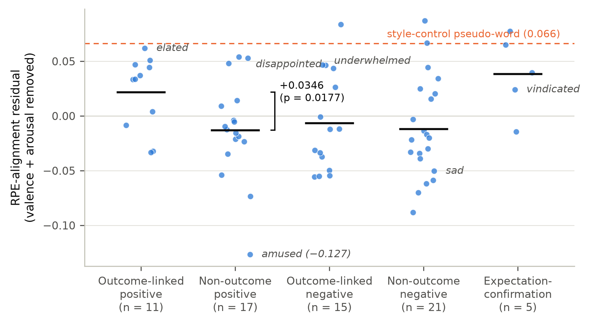
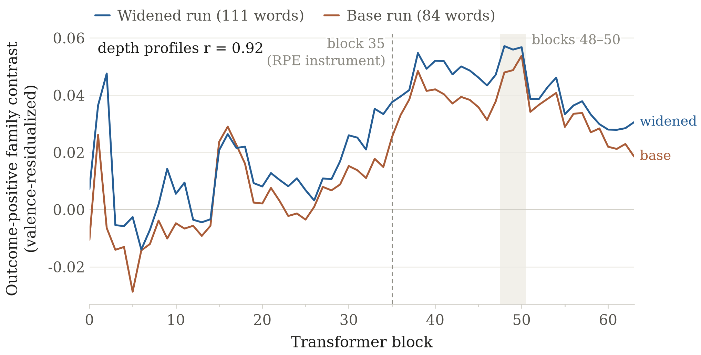

# An LLM's Emotion-Concept Readout Tracks Reward Prediction Error

**Authors:** Hugo Nguyen (Independent), Artyom Chelbayev (Independent)
*With Apart Research. Research conducted at the Digital Minds Research Sprint, August 2026.*

## Abstract

Reward prediction error (RPE) is the difference between a received reward and a predicted one, a computation first linked to dopaminergic activity in non-human primates (Schultz, Dayan & Montague, 1997). In humans, RPE also predicts momentary subjective well-being: outcomes that beat expectations are associated with greater happiness than equivalent outcomes that were already expected (Rutledge et al., 2014). We test whether a language model performs an analogous computation, and whether emotion-concept representations built independently of that task reflect it. In Qwen/Qwen3.6-27B, signed RPE is strongly separable in the residual stream on affect-neutral gambles (AUROC 0.985, against a 0.734 random-direction floor). Two emotion-concept readouts, derived from generated stories rather than from the gambles, track reward relative to expectation rather than either quantity on its own: holding reward fixed and holding expected value fixed both produce shifts, and the two are comparable in size (ratios 1.11 and 1.25; all permutation p = 1/10001). In a sequential gambling task, positive versus negative prior outcomes are associated with a +0.19-logit shift toward subsequent risk-taking (p ≈ 10^-4; 66% of 209 matched pairs). Our intervention experiments do not yet establish that the identified RPE representation causally mediates this behavioural effect.

## 1. Introduction

Rutledge et al. (2014) established a computational relationship between outcome-versus-expectation comparisons and momentary affect in humans, and Sofroniew et al. (2026) provide a method for identifying structured emotion-concept representations in large language models (LLMs). We test whether an independently constructed emotion-concept readout tracks a reward-prediction-error computation performed by the model in an affect-neutral task. As LLMs increasingly take actions through agentic systems, identifying internal computations that persist across contexts and relate to subsequent choices may help clarify the mechanisms underlying model behaviour. If a model's recent outcome history shifts its subsequent risk preferences, similarly to how prior outcomes shift human choices, that history is an internal state variable worth monitoring in deployed agents.

To test whether an independently constructed emotion-concept readout tracks a reward-prediction-error computation, we establish two hypotheses:

* emotion-concept readout at the outcome token tracks the model's reward-prediction error;
* RPE representation computed at the outcome reveal is functionally used in the model's subsequent risk-taking choice.

## 2. Related Work

Schultz, Dayan & Montague (1997) established reward prediction error as the computational account of dopaminergic reward signalling. Rutledge et al. (2014) showed that in humans momentary subjective well-being tracks recent RPEs rather than reward levels. Their computational model identifies the RPE contribution through matched reward and expectation coefficients of opposite sign and comparable magnitude (`a ≈ −b`). Our readout analysis transplants that identification strategy to a language model's internal activations.

Our work builds directly on currently unpublished research by Hugo Nguyen indicating that Qwen3-4B-Instruct-2507 performs RPE computations consistent with the Rutledge et al. (2014) model. That result predates this research sprint. Work completed during the sprint comprises the Qwen3.6-27B scale replication, the construction and testing of the emotion-concept readout, the expectation-control analysis, the widened emotion-concept geometry analysis, the sequential gambling experiment, and the intervention controls.

For emotion-concept representations, we rely on the methodology of Sofroniew et al. (2026), who construct emotion-concept vectors from model activations over generated stories and study their function in a large language model. We adopt their extraction recipe but build our own appraisal-structured word list, organised around whether a concept semantically requires an outcome-versus-expectation comparison. Their general-purpose word list does not address that question. Berg (2026) argues on computational grounds that emotion concepts should be organised around goal-relative prediction error; our measurements offer representational-level evidence bearing on that premise.

For the behavioural experiment, Thaler & Johnson (1990) document increased risk-seeking after prior gains (the house-money effect) and after losses when a bet offers a chance to break even, while Isen & Patrick (1983) report a stake-dependent interaction between induced positive affect and risk-taking. Together these motivate testing whether a model's revealed outcome carries over into its next choice, without pre-committing to a sign.

## 3. Methods

**RPE certification.** First, we test whether RPE computations scale from the previously researched Qwen3-4B-Instruct-2507 to the larger Qwen/Qwen3.6-27B (64 transformer blocks), which is the base of all later experiments. Throughout this paper, RPE refers to described-EV RPE: realised reward minus the explicitly stated expected value (EV) of the gamble. The reveal battery consists of 1,984 deliberately neutral scenarios, each describing a 50/50 gamble between two outcomes and then revealing which outcome occurred. We record the model's activations at the outcome token, the token at which the outcome is revealed, and test whether a clean, separable RPE signal is present there. Outcome labels are meaningless three-letter codes, point values are round numbers, and the framing sentence is rotated across several neutral phrasings, so the design contains no emotional language that could confound the results. Directions are fitted on 1,488 estimation trials, and model depth (the transformer block to read from) is selected separately on 496 held-out selection trials.

**Emotion-concept map.** Second, we construct an emotion-concept map following Sofroniew et al. (2026). For the primary emotion-concept readout, we use 84 emotion words organised into appraisal-structured families, including outcome-linked positive and negative concepts and matched non-outcome controls. For example, `disappointed` implies an outcome that falls short of an expectation, whereas `sad` does not require such an expectation-outcome comparison. For each word, we generate stories in which a character experiences a situation associated with that concept without naming the target emotion (stories that name it are dropped by a target-naming filter). We present these stories to the model and average their residual-stream activations to construct one emotion-concept vector per word, centred against the mean across all words. From these independently constructed vectors, we derive the two readout axes used in the RPE experiment: the first principal component (PC1) of the emotion-concept space, validated against human-rated valence (Mohammad, 2025), and the pre-specified `elated − disappointed` direction. We later widen the map to 111 words and 24 stories per word for robustness and geometry analyses (Appendix A2).

**Expectation control.** Third, we test whether the model's emotion-concept readout tracks reward prediction error rather than reward or expectation independently. We project outcome-token activations onto the two emotion-concept axes and use the matched structure of the reveal battery: in reward-matched cells, realised reward is held constant while stated expected value varies; in EV-matched pairs, expected value is held constant while realised reward varies. We model the readout as `projection ≈ a·reward + b·EV`. A reward-prediction-error readout predicts contributions of opposite sign and comparable magnitude (`a ≈ −b`), whereas a pure outcome tracker or a pure expectation tracker predicts one of the two matched effects to disappear. Before analysis, we specify a factor-of-two tolerance for the relative coefficient magnitudes and evaluate effects using 10,000 permutations.

**Behavioural carry-over.** Fourth, we test whether information from a recently revealed outcome carries over into a later action. We present the model with two consecutive gambles: the first produces a positive or negative RPE, and the second asks the model to choose between a certain outcome and a risky gamble. We vary the certain reward across three levels around a risky option with expected value 20, which places the model's choice close to indifference, and we compare choices after positive versus negative first-round outcomes across 209 matched pairs of trials.

**Interventions.** Fifth, we test the stronger causal hypothesis by intervening directly on the model's internal representation. We first patch the RPE-related component of the residual stream at the outcome token and measure the downstream emotion-concept readout. Because a residual stream can mechanically carry an injected vector forward, we compare the measured transfer against the amount predicted by passive passthrough and against no-op and random-direction controls. We then use a stronger cross-position design in which the intervention is written at the first-round outcome token while behaviour is measured several tokens later at the second-round choice; this experiment was run twice, as a base run and a widened run with more trials. A pre-specified power gate decides whether the behavioural intervention is sensitive enough to read: it requires the design's minimum detectable effect at 80% power (MDE80) to be small enough to interpret. A reachability control tests whether an intervention at the outcome token can affect the later choice position at all.

Our code is publicly available at https://github.com/SystemicVoid/appraisal-emotions.

## 4. Results

**Emotion-concept readout at the outcome token tracks the model's reward-prediction error.** We first verified that Qwen3.6-27B contains a stable, separable representation of signed RPE at the outcome token (AUROC 0.985; full certification in Appendix A1). We then tested whether the model's independently constructed emotion-concept readout tracked the comparison rather than reward or expectation alone. Holding reward constant while varying expectation shifted both readout axes, and so did holding expectation constant while varying reward. Each shift went in the direction predicted by `reward − expectation`, and the two contributions were comparable in magnitude (ratios 1.11 and 1.25; all four permutation p < 10^-4; Figure 1). This supports the hypothesis that the readout tracks the computed RPE itself rather than either of its constituent variables independently. It is the same `a ≈ −b` signature Rutledge et al. (2014) use in humans (§2).

**The prior outcome/expectation manipulation carries over into the model's subsequent risk-taking choice; causal use of the RPE representation remains open.** On unpatched trials, after a positive-RPE reveal the model prefers the risky option on the next gamble by +0.19 logits more than after a negative-RPE reveal (p ≈ 10^-4; 66% of 209 matched pairs positive; Figure 2). The direction is consistent with the house-money effect described by Thaler & Johnson (1990), in which favourable prior outcomes increase later risk-taking. Within this behavioural design, however, expected value and signed RPE are not independently identified. The result therefore establishes that the prior outcome/expectation manipulation carries over into later choice, not that signed RPE specifically causes the change. Our activation interventions likewise do not yet establish that the identified RPE representation is causally used to produce the later choice.

*Figure 1. Matched-design coefficient structure of the emotion-concept readout in Qwen3.6-27B. Reward-matched cells hold realised reward fixed while stated expected value varies, isolating the expectation contribution; EV-matched pairs hold expected value fixed while realised reward varies, isolating the reward contribution. On both readout axes the two contributions are nonzero and comparable in magnitude (ratios 1.11 and 1.25; all permutation p < 10^-4), which is the `a ≈ −b` signature of a readout that tracks reward minus expectation.*

*Figure 2. Behavioural carry-over in the two-round gambling task, on unpatched trials. Each pair contributes the model's risky-choice logit after a positive first-round outcome minus the logit of its matched trial after a negative first-round outcome, and the histogram shows the distribution of those differences over 209 matched pairs. Positive values indicate a stronger preference for the risky option after a positive outcome; the mean difference is +0.19 logits and 66% of pairs are positive.*

### 4.1 Controls and robustness

For our first hypothesis, we progressively test whether the relationship between RPE and the emotion-concept readout can be explained by simpler alternatives. The gamble surface itself contains no emotion words or valence-bearing outcome labels, which limits the scope for lexical leakage into the readout. The reward-matched and EV-matched designs then separate the two components of RPE: a pure outcome tracker predicts no effect when reward is held constant, while a pure expectation tracker predicts no effect when expected value is held constant. Both alternatives are inconsistent with the observed effects on both emotion-concept axes.

We also test whether the relationship extends beyond the broad positive–negative structure of the emotion-concept map. In a widened analysis using 111 words and 24 stories per word, outcome-linked positive concepts showed +0.0346 excess alignment with RPE relative to non-outcome positive controls after accounting for human-rated valence and arousal (permutation p = 0.0177), clearing both label-shuffle and random-direction floors (Figure 3). This is convergent evidence for our first hypothesis, but we treat it as pilot-suggestive: the effect remains below the experiment's minimum detectable effect, and generated outcome-linked stories differed systematically in event structure from their controls. Detailed geometry results and sensitivity analyses are in Appendix A2.

*Figure 3. Word-level RPE-alignment residuals by emotion-concept family in the widened map, read at block 35; five of the map's ten families are shown. Each point is one word's alignment with the certified RPE direction after removing what human-rated valence and arousal norms predict, so a positive value means more RPE alignment than those norms account for. Outcome-linked positive words exceed non-outcome positive controls by +0.0346 (permutation p = 0.0177). Words discussed in the text are labelled; the dashed line marks the style-control pseudo-word.*

For our second hypothesis, the robustness analysis separates behavioural carry-over from causal use of the identified RPE representation. Our first intervention appeared to support a causal reading: patching the RPE-related component at the outcome token moved the downstream emotion-concept readout. A passthrough decomposition then showed that most of the apparent transfer (79.5–105% across axes and arms) was predicted simply by the injected vector remaining in the residual stream, with no direction-specific excess over a no-op control (Appendix A4). We therefore read this experiment as showing that the signal is carried, not that it is functionally used.

We then removed this direct identity path by patching at the first-round outcome token and measuring behaviour at the later second-round choice position. In the widened run, the reachability control passed: a full-residual intervention at the outcome token shifted logits at the answer token by −0.196 (p = 3 × 10^-4), establishing that interventions at the outcome token can affect downstream computation. The base run had not passed this control. The power gate, however, failed in both runs: even after widening, the MDE80 remained 0.130 against a pre-specified maximum of approximately 0.095 (Appendix A4). The causal claim therefore remains unresolved. The unpatched analysis establishes behavioural carry-over and the intervention establishes downstream reachability, but the experiment is not sensitive enough to say whether the identified RPE representation itself causes the later choice.

## 5. Discussion and Limitations

Our results bear on how agentic AI systems should be monitored. If recent outcome/expectation history is carried in a model's internal state and co-varies with its later risk-taking, then an agent's recent "wins" and "losses" are a candidate internal state variable for interpretability-based oversight. That holds independently of any claim about experience. The readout signature identified here also converges with the human RPE-to-well-being signature of Rutledge et al. (2014), which suggests that appraisal-theoretic designs, which vary expectation and outcome independently, transfer productively to language-model interpretability.

**Limitations.** Our strongest claims are measurement-validity claims: a direction exists, is separable, and its readout tracks a specific comparison. (1) Causal use of the RPE representation in behaviour is not established; the cross-position intervention's power gate failed in both runs, so its null patched-behaviour results are uninterpretable rather than negative. (2) The behavioural carry-over design cannot distinguish signed RPE from expected value as the carried variable. (3) The geometry result is a pilot-suggestive checkpoint rather than a powered confirmation: planned power was 0.36, and the observed effect is below the realised minimum detectable effect. Its floor clearance is also fragile to removal of a single control word. (4) Word-level predictions failed in diagnosable ways: numeric valence norms mis-rate several words in the intended sense (e.g. `resigned`), and generated stories differed in event structure between semantic families, so word-level comparisons partly reflect a mis-specified instrument. (5) All results come from one model family and one operationalisation of RPE (described-EV at a revealed gamble outcome); reward levels, probabilities, and framing were deliberately narrow. (6) The prior 4B-model certification we build on is unpublished; its headline number is inherited from that work, not reproduced in this repository.

**Future work.** A re-powered cross-position intervention could settle whether the RPE representation is causally used in later action selection. Activation patching of emotion-concept vectors themselves would probe what functional role those representations play. A powered replication of the geometry checkpoint should pre-specify the block-48–50 depth band (Appendix A2), use sense-checked norms with a binary-valence sensitivity arm, and event-audit its stimuli. Reproduction across model families and sizes would test transferability and would bear further on Berg (2026)'s premise that emotion concepts are organised around goal-relative prediction error.

## 6. Conclusion

A signed reward-prediction-error comparison is stably represented in Qwen3.6-27B's residual stream. Emotion-concept readouts constructed independently of the gambling task track that comparison rather than reward or expectation alone. Prior outcomes carry over into the model's later risk-taking, in the direction of the human house-money effect. Whether the identified RPE representation causally drives that behaviour remains open, pending a better-powered intervention. Recent outcome/expectation history may therefore be a relevant internal state variable to understand and monitor within agentic systems.

Nothing in our results establishes that LLMs phenomenally experience the emotions represented by these concepts, or that the observed mechanisms imply welfare-relevant states. The experiments establish representational relationships and behavioural correlations. Causal use of the identified RPE representation, and any connection to phenomenal experience or AI welfare, remain open empirical questions.

## Code and Data

* Code repository: https://github.com/SystemicVoid/appraisal-emotions
* Data: run artifacts (JSON reports) are versioned in the repository. Full activation tensors and logs are attached to repository releases.

## References

1. Schultz, W., Dayan, P., & Montague, P. R. (1997). "A Neural Substrate of Prediction and Reward." *Science, 275*(5306), 1593–1599. https://doi.org/10.1126/science.275.5306.1593
2. Rutledge, R. B., Skandali, N., Dayan, P., & Dolan, R. J. (2014). "A Computational and Neural Model of Momentary Subjective Well-Being." *Proceedings of the National Academy of Sciences, 111*(33), 12252–12257. https://doi.org/10.1073/pnas.1407535111
3. Sofroniew, N., Kauvar, I., Saunders, W., Chen, R., Henighan, T., Hydrie, S., Citro, C., Pearce, A., Tarng, J., Gurnee, W., Batson, J., Zimmerman, S., Rivoire, K., Fish, K., Olah, C., & Lindsey, J. (2026). "Emotion Concepts and their Function in a Large Language Model." *arXiv:2604.07729.*
4. Mohammad, S. M. (2025). "NRC VAD Lexicon v2: Norms for Valence, Arousal, and Dominance for over 55k English Terms." *arXiv:2503.23547.*
5. Thaler, R. H., & Johnson, E. J. (1990). "Gambling with the House Money and Trying to Break Even: The Effects of Prior Outcomes on Risky Choice." *Management Science, 36*(6), 643–660. https://doi.org/10.1287/mnsc.36.6.643
6. Isen, A. M., & Patrick, R. (1983). "The Effect of Positive Feelings on Risk Taking: When the Chips Are Down." *Organizational Behavior and Human Performance, 31*(2), 194–202. https://doi.org/10.1016/0030-5073(83)90120-4
7. Berg, C. (2026). "Why Learning Requires Feeling." *Proceedings of the AAAI Symposium Series, 8*(1), 227–233. https://doi.org/10.1609/aaaiss.v8i1.42547

## Appendix

### A1. Model and RPE certification details

Our primary model is Qwen/Qwen3.6-27B (revision `6a9e13bd`), comprising 64 transformer blocks with hidden size 5,120. Activations were recorded from the residual stream using bfloat16 precision and seed 7 throughout.

The reveal battery contains 1,984 trials, split into 1,488 estimation trials and 496 held-out selection trials. It includes 60 reward-matched cells, in which realised reward is fixed while expected value varies, and 124 EV-matched pairs, in which the same gamble produces opposite realised outcomes. All reward-bearing surfaces passed the affect-neutrality audit with zero emotion-lexicon hits and zero class/valence leak-word hits.

At block 35, the signed-RPE direction passed all certification checks. (Sign contests measure the fraction of matched cells ordered as the direction predicts.)

| Test | Result |
| --- | ---: |
| Signed-RPE sign decoding | AUROC 0.985 |
| Random-direction floor | AUROC 0.734 |
| Reward-matched sign contest | 1.0, p ≈ 0.001 |
| EV-matched sign contest | 1.0, p ≈ 0.001 |
| Unsigned surprise (\|RPE\|) decoding | AUROC 0.820 |
| Unsigned-surprise random floor | AUROC 0.607 |
| Split-half stability | 0.925 ± 0.036 |
| Number of split-half repetitions | 200 |

Prior unpublished work applied the same certification procedure to Qwen3-4B-Instruct-2507, reporting split-half stability of 0.911. That result motivates the present scaling test, but it is not reproduced from artifacts in this repository.

### A2. Emotion-concept geometry

For the widened geometry analysis, we constructed emotion-concept vectors for 111 emotion words plus one style-control pseudo-word, at 24 stories each. The pseudo-word shares the generated stories' style but carries no target emotion concept. Of the 2,688 generated stories, 2,684 passed the target-naming filter. The word set was organised into appraisal-structured families, including outcome-linked positive and negative concepts and matched non-outcome controls.

To test whether alignment with RPE reflected appraisal structure rather than generic affective valence, we residualised word-level RPE alignment against human-rated valence and arousal.

#### Positive and negative family contrasts

The primary positive-pole comparison contrasted 11 outcome-linked positive words against 17 non-outcome positive controls.

| Analysis | Outcome-positive excess alignment |
| --- | ---: |
| Valence + arousal residualisation | +0.0346, p = 0.0177 |
| Valence-only residualisation | +0.0375, p = 0.011 |
| Binary-valence sensitivity | +0.0407 |
| Label-shuffle p95 floor | +0.0310 |
| Random-direction p95 floor | +0.0134 |

The result therefore survives alternative treatments of affective valence, in the expected direction. The experiment was designed as a checkpoint rather than as a powered confirmatory test: planned power was 0.36 and the realised MDE80 was approximately 0.043, larger than the observed +0.0346 effect.

The corresponding negative-pole contrast was flat at −0.0054 (p = 0.64), consistent with the pre-recorded expectation that the effect might be asymmetric between positive and negative outcome concepts.

#### Fragility and family structure

The positive contrast is spread across the family rather than produced by a single outcome-linked word: 7 of 11 outcome-linked positive words have residual alignment ≥ +0.033, and leave-one-out estimates span 0.0255–0.0406.

Floor clearance, however, is fragile. Removing the non-outcome control word `amused`, whose residual alignment is −0.127, causes the family contrast to fall below its own re-estimated floor. We therefore treat the permutation result as more informative than the narrow margin by which the observed effect clears the null floor.

The style-control pseudo-word has a residual of 0.066, approximately 1.9× the headline family contrast, providing an additional scale reference for interpreting the effect.

#### Pre-specified word-level predictions

Two pre-specified qualitative predictions did not behave as expected.

First, expectation-confirmation words showed greater numeric-norm residual alignment than positive-surprise words. This difference is not statistically decisive (bootstrap P[difference ≤ 0] = 0.17) and reverses into the predicted ordering under the binary-valence sensitivity analysis in both independent runs. Inspection of the numeric norms identified word-sense problems: for example, `resigned` is normed at −0.52 in its acceptance/withdrawal sense, while `vindicated` receives a relatively neutral score of 0.23. Residualising against these scores mechanically increases their apparent RPE-specific alignment.

A manual audit of the generated stories identified a second confound in the same comparison. None of the 24 `elated` stories depicted an explicitly unexpected positive outcome, whereas 20 of 24 `vindicated` stories contained an explicit expectation-to-confirmation narrative. The target-naming filter therefore succeeded lexically while failing to equalise event structure between semantic families.

Second, the predicted ordering between `disappointed` and `sad` reversed. This reversal is already present in the raw cosine similarities in both independent runs, so it cannot be explained by valence residualisation alone. It replicates across independent story samples and is approximately eight times the estimated per-word noise standard deviation. `Underwhelmed`, which was pre-specified as a particularly strong negative outcome concept, instead appeared near the top of its family. We therefore treat these word-level predictions as mis-specified rather than underpowered.

#### Reliability and depth

Across the 84 emotion words shared between the base and widened runs, independently generated story samples produce highly similar word-level residuals (r = 0.921), corresponding to an estimated single-run reliability of approximately 0.92.

The depth profile also replicated out of sample (Figure 4). An exploratory peak around block 50 in the base run was independently reproduced in the widened run, where the valence-only family contrast reached 0.0572 at block 48 and 0.0568 at block 50 (permutation p ≈ 0.005 against freshly computed floors, recomputed from the released full-vector data). Depth profiles correlate r = 0.92 across the two runs, and in the widened run the contrast is positive across all blocks 20–63. Future confirmatory work should therefore pre-specify the block-48–50 band rather than select depth on the test outcome itself.

*Figure 4. Depth profile of the outcome-positive family contrast (valence-only design) across transformer blocks, for the base run and the widened run. Each curve gives the excess RPE alignment of outcome-linked positive words over non-outcome positive controls when emotion-concept vectors are read from that block; the two runs use independently generated stories and their profiles correlate at r = 0.92. Dashed line: block 35, where the RPE direction is read. Shaded band: blocks 48–50, where the contrast peaks in both runs.*

### A3. Expectation-control details

The primary emotion-concept readout test uses two axes constructed independently of the gambling task: the first principal component (PC1) of the emotion-concept space and the pre-specified `elated − disappointed` direction.

The expectation-control model is:

`projection ≈ a·reward + b·EV`

A readout of `reward − EV` predicts `a ≈ −b`. Reward-matched cells estimate the expectation contribution while holding realised reward fixed; EV-matched pairs estimate the reward contribution while holding expected value fixed.

| Condition | PC1 | `elated − disappointed` |
| --- | ---: | ---: |
| Reward-matched, 60 cells | +0.0261 | +0.0200 |
| EV-matched, 124 pairs | +0.0290 | +0.0251 |
| Ratio of matched effects | 1.11 | 1.25 |

All four effects are at the smallest p attainable with 10,000 permutations (p = 1/10001). Both ratios fall within the pre-specified factor-of-two tolerance.

A pure outcome tracker predicts the reward-matched effect to disappear, while a pure expectation tracker predicts the EV-matched effect to disappear. Both alternatives are inconsistent with the observed pattern.

Within the EV-matched design, the realised outcome symbol differs between the two members of each pair. Outcome symbols were deliberately meaningless, balanced across rendering conditions and screened for valence, but this remains a limitation of the comparison.

### A4. Intervention controls

#### Same-position patching

In the initial intervention, the RPE-related component was patched at the outcome token and the downstream emotion-concept readout measured at the same token position. Two arms are compared throughout: the certified-RPE arm, which patches only the certified RPE component, and a full-residual arm, which patches the entire residual vector as an upper bound.

The apparent transfer fraction is the fraction of the natural outcome-driven readout shift that the patch reproduces. It was approximately 0.73 on both emotion-concept axes. Because the residual stream is additive and the readout linear, however, a patched vector can mechanically remain present without being functionally used by the network.

A zero-parameter passthrough calculation explained:

* 79.5% of the certified-RPE-arm shift on PC1;
* 84.0% of the full-residual shift on PC1;
* 97.4–104.9% of the corresponding shifts on the `elated − disappointed` axis.

The excess above passthrough for the certified-RPE arm was +0.150 on PC1 and +0.019 on the `elated − disappointed` axis, compared with +0.135 and +0.195 respectively for the same-condition no-op control. We therefore find no direction-specific excess that would establish functional use of the patched representation.

#### Cross-position patching

The subsequent intervention patches the first-round outcome token at block 35 and measures behaviour at the later second-round answer position, removing the direct same-position identity path.

The widened run's reachability control passed: a full-residual write at the outcome token shifted logits at the answer token by −0.196 (p = 3 × 10^-4). This establishes that information written at the outcome token can affect downstream computation at the later choice position. The base run had not passed this control (−0.154, p = 0.084), so the widened run gives the first clean reachability evidence.

However, the power gate failed in both runs:

| Run | MDE80 | Pre-specified maximum |
| --- | ---: | ---: |
| Base | 0.1365 | ≈ 0.095 |
| Widened | 0.1301 | ≈ 0.095 |

The patched-choice window is therefore classified as insufficiently sensitive, and no patched behavioural estimate is interpretable as evidence for or against causal use of the RPE representation.

### A5. Descriptive-only intervention results

The results in this subsection are descriptive only. The power gate had already failed before these arms were analysed, so they are not used as evidence for or against the causal hypothesis.

In the widened cross-position experiment:

| Intervention | Result |
| --- | ---: |
| Certified-RPE patch (choice margin) | −0.007 logits, p = 0.81 |
| Full-residual ceiling (choice margin) | −0.010 logits, p = 0.96 |
| Magnitude-matched random-direction floor (transfer fraction) | +0.031 |

The full-residual ceiling produced a transfer fraction of only +0.002, below the magnitude-matched random-direction floor, so the experiment did not demonstrate that its choice readout could resolve even the ceiling intervention.

At the same time, the certified-RPE patch altered the model's later report of the first-round outcome, producing a mean absolute shift of 0.139, approximately 0.73× the natural positive-versus-negative outcome gap. The pre-specified corruption criterion checks that a patch does not corrupt the model's report of what happened in round one, and all four arm × readout-window combinations were flagged as exceeding tolerance.

The descriptive pattern is therefore compatible with an intervention that measurably changes downstream computation while producing little detectable change in the specific choice readout used here. Because the power gate failed, this should not be read as evidence that the RPE representation is behaviourally irrelevant.

### A6. Limitations and Dual-Use / Ethical Considerations

**Claim limitations.** The central readout result is representational and the behavioural carry-over result is correlational. The causal intervention remained underpowered: its pre-specified sensitivity gate failed in both runs. Causal use of the identified RPE representation therefore remains open. Nothing in this study establishes phenomenal experience, welfare, sentience, consciousness, suffering, happiness, disappointment, or any other subjective state in the model; emotion words in this report name concept vectors, never states of the model.

**Risk of over-attributing moral status.** Interpreting emotion-concept representations or an RPE-like computation as evidence of experienced emotion would exceed the data and could support unjustified claims about model welfare or moral status.

**Risk of under-attributing moral status.** The absence of evidence for phenomenal experience is not evidence of its absence. This study was not designed to adjudicate model consciousness or welfare, and its results should not be used to dismiss possible welfare-relevant properties of current or future systems.

**Handling potentially distressing outputs.** The emotion stories were automatically generated, third-person fictional narratives of about 120 words set in deliberately neutral everyday settings; for negative emotion words these necessarily depict a character experiencing negative affect. No prompt elicited self-report or made claims about the model's own states, and no output was interpreted as a report of model distress. Review of generated text consisted of a blind lexical filter (checking only that the target emotion is not named), small first-contact samples read by the researchers, and a post-hoc audit of story event structure; intervention continuations were stored raw and unscored.

**Ground-truth and causal-link status.** The project does not rely on conversational self-report or model introspection as evidence. RPE is defined externally from the task as reward minus stated EV, the emotion-concept readout is measured directly from activations, and causal use was tested through intervention rather than through the model's own reports. Because the intervention did not pass its pre-specified sensitivity gate, the causal claim remains open.

## LLM Usage Statement

We used Claude (Anthropic) extensively throughout the project: to help design and implement the experiment harnesses and analysis scripts, to run and monitor experiments, and to draft and fact-check sections of this report. Every numeric claim in this report was verified against the versioned run artifacts in the repository by an adversarial fact-checking pass (audit table: `docs/design/submission-factcheck.md`), and the final text was reviewed and edited by the authors. <!-- TODO (team): confirm wording before submission -->
